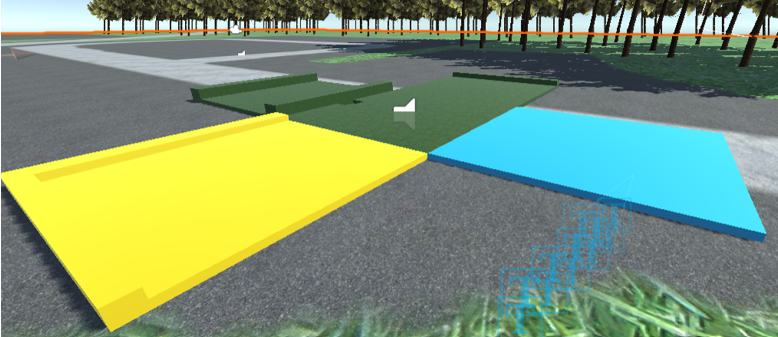

# Virtual Reality
## Assignment 3: Advanced VR

**Name:** Prateek Sengar  

[Project Download Link](https://drive.google.com/file/d/1G6tbc5eDGl5xd9O4iCMhT0-xwwNAQdcH/view?usp=sharing) 

[Project Demo Video](https://youtu.be/zJ1xeLo7Bd8) 

---

In this assignment, I implemented a mini-golf simulator where the user can build and play mini golf in the Stony Brook campus subsection that I created in Assignment 1. The user can choose between the following three modes:
- Navigation Mode: The user can effortlessly move around the area.
- Build Mode: Create a mini-golf course by setting up the necessary elements on the ground.
- Play Mode: Use your Build Mode to create a mini-golf course and play on it. The user should spawn on the campus map in Navigation Mode at the beginning.

**Unity Version:** 2020.3.25

## Scene
As suggested, I reused the subsection of the campus I built for assignment 1 (Subsection: P (Heavy Engineering)) with the following additions. The user has the ability to travel around the campus, go in and out of the Heavy Engineering Building, and build and play golf anywhere on the campus (including inside the building!).

### Switching Between Modes
**1. Navigation Mode**
The user starts out in navigation mode and can travel around the map in the following ways:
- Physical: The user can physically walk in the real world to make the character move.
- Thumb-stick Navigation: By using the left thumb-stick, the user can traverse around the map.
- Teleportation: By using the right thumb-stick, the user’s right-hand controller shoots a bending ray that can help the user teleport between 1m to 10m.

  

  

**2. Build Mode**
Start build mode by pressing the Y button on the left controller. This casts a ray from the left controller which can be used to position and rotate the tiles.

I have also implemented a UI for the selection of tiles. This UI can be turned on and off using the X button, and the UI window follows the player and orients itself in front of the user (even if the user moves around).

The ray turns blue if there is a selectable tile, and when pressed, the trigger the tile appears and the tile is fully interactable (can be moved around, can be brought closer and sent further, can be rotated), and tiles can be grabbed using the left controller grip.

When placed on the ground, the tiles align perfectly as I have used a 2-D grid that has multiple colliders and handled the positioning of the tiles using some scripts.

**Tiles**
I have implemented 10 tiles in total in which two are start and end tiles. Others are 4 grass tiles (plane, 1 bumper, 2 bumpers straight, 2 bumpers corner) and remaining 4 are the sand variants (having greater friction). The grass tiles are green, and the sand tiles are yellow. The blue tile is the start tile, and the tile with a hole (the one in the middle) is the hole tile.

Also, I added some birds for better immersion which travel in a constant path and have flying animations attached.

**3. Play Mode**
When the player is done building, they can play the mini-golf course they created by stepping on the start tile. When the user steps on the tile, there is a gold ball instantiated in the center of the tile and they are automatically placed near a golf ball with a gold stick in their right hand.

The player can hit the ball, and when the ball stops, the player is teleported right next to it for their next turn.
When the ball is hit 3 times, the game is over, and the stick is removed from the player’s hands and a “Game Over” sound is played.
When the ball goes into the hole, the stick gets removed, and the “Victory” sound is played suggesting that the player was successful in putting the ball in the hole.

## Extra Credits
1. I implemented the sand variants of the tiles.
2. I implemented an advanced menu for the tile selection.

## Hierarchy

References 
1. XR Interaction Toolkit [2.3.0] (Complete XR Origin Set Up Prefab, Scripts)
2. Unity VR Game Basics 2022 by Fist Full of Shrimp: [YouTube Playlist](https://youtube.com/playlist?list=PLX8u1QKl_yPDn0-_fMYjJ_5hIA397L-z6) (Used Scripts for Ray Interactor and Teleportation)
3. Justin P Barnett's YouTube Channel: [YouTube Channel](https://www.youtube.com/@JustinPBarnett) (Watched some of his videos for basics and teleportation)
4. Grid System: [YouTube Tutorial](https://www.youtube.com/watch?v=qkSSdqOAAl4&ab_channel=MetalStormGames) [Code Used]
5. Free music and SFX collection: [Unity Asset Store](https://assetstore.unity.com/packages/audio/music/free-music-and-sfx-collection-4369)
6. Egypt Pack – Eagle: [Unity Asset Store](https://assetstore.unity.com/packages/3d/characters/animals/birds/egypt-pack-eagle-140079)
7. Toon Furniture: [Unity Asset Store](https://assetstore.unity.com/packages/3d/props/furniture/toon-furniture-88740)
8. Mobile Tree Package: [Unity Asset Store](https://assetstore.unity.com/packages/3d/vegetation/trees/mobile-tree-package-18866)
9. Pro Builder Tool
10. Materials and Channel Mixer
